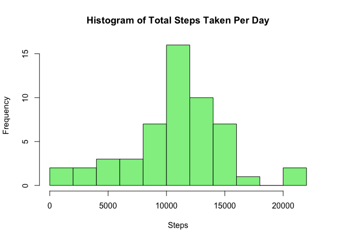
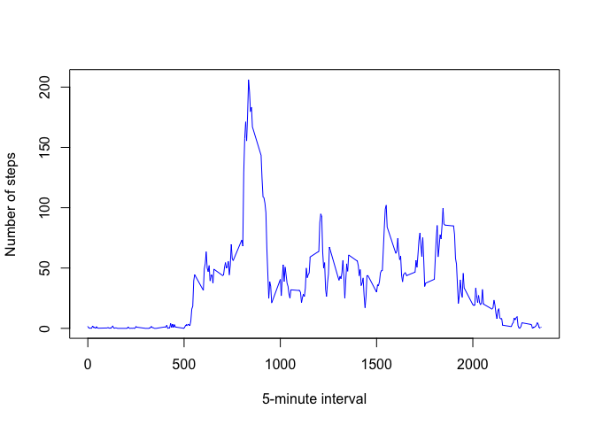
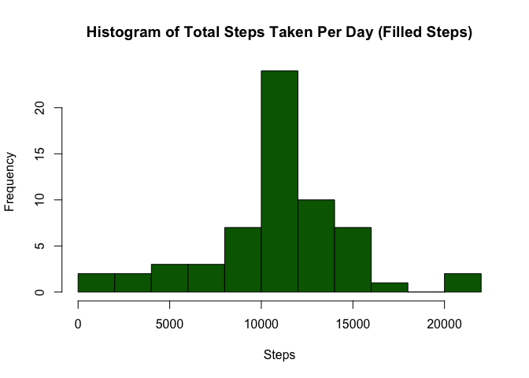
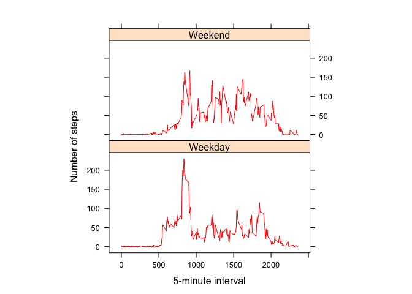

# Reproducible Research: Peer Assessment 1


## Loading and preprocessing the data


1. Unzip activity.zip to obtain activity.csv. Place in same directory. 


```r
unzip(zipfile="activity.zip", overwrite=TRUE)
```

2. Read csv into Data Frame "activityDF". Output column names and compact structure.


```r
activityDF <- read.csv("activity.csv",stringsAsFactors=FALSE)
names(activityDF)
```

```
## [1] "steps"    "date"     "interval"
```

```r
str(activityDF)
```

```
## 'data.frame':	17568 obs. of  3 variables:
##  $ steps   : int  NA NA NA NA NA NA NA NA NA NA ...
##  $ date    : chr  "2012-10-01" "2012-10-01" "2012-10-01" "2012-10-01" ...
##  $ interval: int  0 5 10 15 20 25 30 35 40 45 ...
```

## What is mean total number of steps taken per day?

- The Aggregate R function is used. It excludes dates from result when there are no records.

1. Calculate the total number of steps taken per day. Make a histogram of the total number of steps taken each day.


```r
aggTotalSteps <- aggregate(steps ~ date, data = activityDF, sum, na.rm = TRUE)
hist(aggTotalSteps$steps, breaks = 10, main="Histogram of Total Steps Taken Per Day", xlab="Steps", col="lightgreen")
```

 


2. The mean of the total number of steps taken per day (rounded): 

```r
round(mean(aggTotalSteps$steps),0)
```

```
## [1] 10766
```
3. The median of the total number of steps taken per day: 

```r
median(aggTotalSteps$steps)
```

```
## [1] 10765
```


## What is the average daily activity pattern?

1. A time series plot (i.e. type = "l") of the 5-minute interval (x-axis) and the average number of steps taken, averaged across all days (y-axis):


```r
aggStepsInterval <- aggregate(steps ~ interval, data = activityDF, mean, na.rm = TRUE)
plot(steps ~ interval, data = aggStepsInterval, type = "l", col="blue", xlab="5-minute interval", ylab="Number of steps")
```

 

2. The 5-minute interval, on average across all the days in the dataset, which contains the maximum number of steps is shown below:


```r
aggStepsInterval[which.max(aggStepsInterval$steps), ]
```

```
##     interval    steps
## 104      835 206.1698
```


## Inputing missing values

- Note that there are a number of days/intervals where there are missing values (coded as NA). The presence of missing days may introduce bias into some calculations or summaries of the data.

1. The total number of missing values in the dataset (i.e. the total number of rows with NAs)

```r
sum(is.na(activityDF$steps))
```

```
## [1] 2304
```

2. The deviced strategy for filling in all of the missing values in the dataset is to fill using the mean for that 5-minute interval. The function below is created to perform this task referencing the step values from "aggStepsInterval".

```r
fnFillInterval <- function(interval) {
    aggStepsInterval[aggStepsInterval$interval == interval, ]$steps
}
```

3. Create a new dataset that is equal to the original dataset but with the missing data filled in.

```r
# Duplicate the activity dataframe
activityFilledDF <- activityDF  

# Loop to fill in values for steps records which are blank
for (i in 1:nrow(activityFilledDF)) {
    if (is.na(activityFilledDF[i, ]$steps)) {
        activityFilledDF[i, ]$steps <- fnFillInterval(activityFilledDF[i, ]$interval)
    }
}
```

4. Make a histogram of the total number of steps taken each day. 


```r
aggTotalStepsFilled <- aggregate(steps ~ date, data = activityFilledDF, sum, na.rm = TRUE)
hist(aggTotalStepsFilled$steps, breaks = 10, main="Histogram of Total Steps Taken Per Day (Filled Steps)", xlab="Steps", col="darkgreen")
```

 

5. The mean of the total number of steps taken per day (rounded): 

```r
round(mean(aggTotalStepsFilled$steps),0)
```

```
## [1] 10766
```

6. The median of the total number of steps taken per day: 

```r
median(aggTotalStepsFilled$steps)
```

```
## [1] 10766.19
```


- Observation: The mean value is the same as the first part of the assignment. However, the median is different from the first part of the assignment.

- Impact of inputing missing data on the estimates of the total daily number of steps: Depending on what we use to fill in the blanks, this would affect the overall picture. In this case, using the 5-minute interval did not affect the mean, but if we were to use median (or other values to fill), the mean too can be impacted.


## Are there differences in activity patterns between weekdays and weekends?


- For this part, we used the weekdays() function. We also used the dataframe with the filled-in missing values for this part.

1. Create a new factor variable in the dataset with two levels – “weekday” and “weekend” indicating whether a given date is a weekday or weekend day.

```r
activityFilledDF$weekcat <- as.factor(ifelse(weekdays(as.Date(activityFilledDF$date)) %in% c("Saturday","Sunday"), "Weekend", "Weekday")) 
```


2. Make a panel plot containing a time series plot (i.e. type = "l") of the 5-minute interval (x-axis) and the average number of steps taken, averaged across all weekday days or weekend days (y-axis). See the README file in the GitHub repository to see an example of what this plot should look like using simulated data.


```r
aggStepsInterval2 = aggregate(steps ~ interval + weekcat, activityFilledDF, mean)
library(lattice)
xyplot(steps ~ interval | factor(weekcat), data = aggStepsInterval2, aspect = 1/2, type = "l", ylab="Number of steps", xlab="5-minute interval", col="red")
```

 

